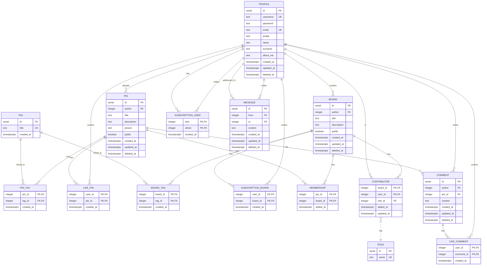

```mermaid    
    erDiagram
        PROFILE {
            serial id PK
            text username UK 
            text password
            text email UK
            text avatar
            text name
            text surname
            text about_me
            timestamptz created_at
            timestamptz updated_at
            timestamptz deleted_at
        }
        TAG {
            serial id PK
            text title UK
            timestamptz created_at
        }
        PIN {
            serial id PK
            integer author FK
            text title
            text description
            text picture
            boolean public
            timestamptz created_at
            timestamptz updated_at
            timestamptz deleted_at
        }
        PIN_TAG {
            integer pin_id PK,FK
            integer tag_id PK,FK
            timestamptz created_at
        }
        LIKE_PIN {
            integer user_id PK,FK
            integer pin_id PK,FK
            timestamptz created_at
        }
        BOARD {
            serial id PK
            integer author FK
            text title
            text description
            boolean public
            timestamptz created_at
            timestamptz updated_at
            timestamptz deleted_at
        }
        BOARD_TAG {
            integer board_id PK,FK
            integer tag_id PK,FK
            timestamptz created_at
        }
        SUBSCRIPTION_BOARD {
            integer user_id PK,FK
            integer board_id PK,FK
            timestamptz created_at
        }
        MEMBERSHIP {
            integer pin_id PK,FK
            integer board_id PK,FK
            timestamptz added_at
        }
        ROLE {
            serial id PK
            text name UK
        }
        CONTRIBUTOR {
            integer board_id PK,FK
            integer user_id PK,FK
            integer role_id FK
            timestamptz added_at
            timestamptz updated_at
        }
        SUBSCRIPTION_USER {
            integer who PK,FK
            integer whom PK,FK
            timestamptz created_at
            
        }
        COMMENT {
            serial id PK
            integer author FK
            integer pin_id FK
            text content
            timestamptz created_at
            timestamptz updated_at
            timestamptz deleted_at
        }
        LIKE_COMMENT {
            integer user_id PK,FK
            integer comment_id PK,FK
            timestamptz created_at
        }
        MESSAGE {
            serial id PK
            integer from FK
            integer to FK
            text content
            timestamptz created_at
            timestamptz updated_at
            timestamptz deleted_at
        }

        PROFILE ||--o{ PIN : uploads
        PROFILE ||--o{ BOARD : creates
        PROFILE ||--o{ MESSAGE : writes
        MESSAGE }o--|| PROFILE : addressed_to
        PROFILE ||--o{ COMMENT : writes
        PIN ||--o{ COMMENT : has
        PROFILE ||--o{ LIKE_PIN : pushes
        PIN ||--o{ LIKE_PIN : has
        PROFILE ||--o{ LIKE_COMMENT : pushes
        COMMENT ||--o{ LIKE_COMMENT : has
        PROFILE ||--o{ SUBSCRIPTION_USER : makes
        PROFILE ||--o{ SUBSCRIPTION_USER : has
        BOARD ||--o{ MEMBERSHIP : has
        PIN ||--o{ MEMBERSHIP : in
        PROFILE ||--o{ SUBSCRIPTION_BOARD : makes
        BOARD ||--o{ SUBSCRIPTION_BOARD : has
        BOARD ||--o{ CONTRIBUTOR : has
        PROFILE ||--o{ CONTRIBUTOR : is
        CONTRIBUTOR }o..|| ROLE : has
        PIN ||--o{ PIN_TAG : has
        BOARD ||--o{ BOARD_TAG : has
        TAG ||--o{ PIN_TAG : linked_to
        TAG ||--o{ BOARD_TAG : linked_to
```